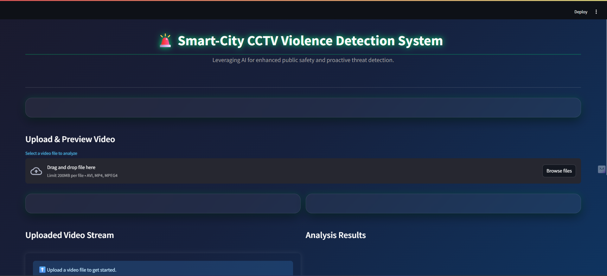
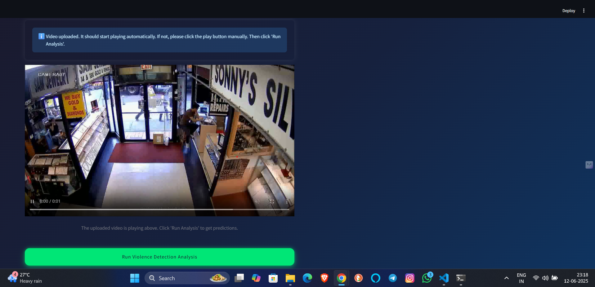
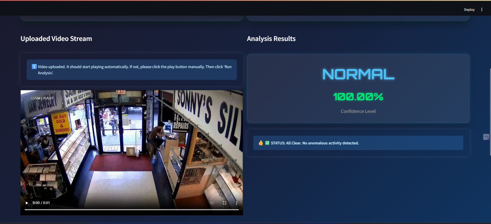
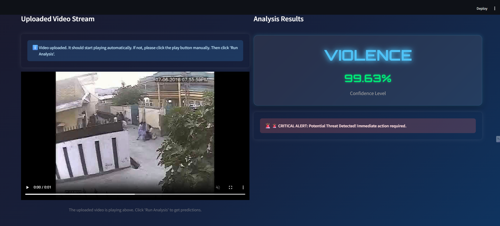
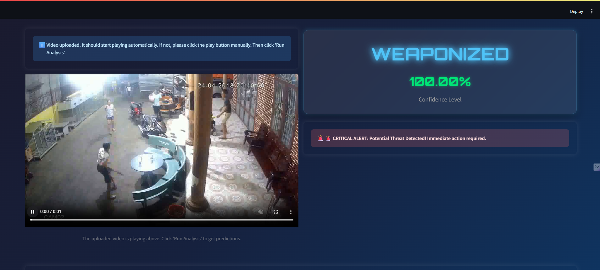

<!-- Project Title and Badges -->
<p align="center">
  <strong>🚨 Smart-City CCTV Violence Detection System</strong>
</p>

<p align="center">
  <a href="https://github.com/Krishna-pathak1535/smart-city-violence-detection">
    
  </a>
  <a href="https://github.com/Krishna-pathak1535/smart-city-violence-detection">
    
  </a>
  <a href="https://github.com/Krishna-pathak1535/smart-city-violence-detection/blob/main/LICENSE">
    
  </a>
</p>

<p align="center">
  
  
  
  
</p>

---

## ✨ Project Overview

An **AI-driven solution for Smart-City CCTV Violence Detection** that automatically identifies and classifies events as **Normal**, **Violence**, or **Weaponized** in surveillance video streams. This system provides **proactive alerts** to monitoring personnel, enhancing public safety in urban environments.

---

## 🚀 System Architecture

1. **Video Ingestion Module**  
   Web interface for uploading common formats (AVI, MP4).

2. **AI Core (CNN-LSTM Model)**  
   Combines Convolutional Neural Network with LSTM for spatio-temporal feature extraction and classifies clips into three categories.

3. **Real-time Prediction & Alerting**  
   Displays predictions (label + confidence) in the UI and triggers visual alerts for detected threats.

4. **Interactive Web UI**  
   Built with Streamlit for easy upload, playback, and visualization.

---

## 🛠️ Technical Approach

- **Deep Learning Model**: CNN-LSTM for spatial and temporal analysis.  
- **Data Handling**: Custom `Keras Sequence` data generator for efficient batch loading on Google Colab GPUs.  
- **Video Preprocessing**: `FFmpeg` to transcode inputs to MP4 (H.264/AAC) for browser compatibility.  
- **UI Development**: Streamlit for rapid, responsive front-end.  
- **Version Control**: Git + Git LFS for large model artifacts; Python `venv` for dependency management.

---

## 🎬 Demo

Run locally:

```bash
streamlit run app.py
```

<p align="center">
  
</p>

---

## **Key Screenshots**

<p align="center">
  
  <br><em>The clean, inviting interface ready for video upload.</em>
</p>

<p align="center">
  
  <br><em>Video playing seamlessly after upload.</em>
</p>

<p align="center">
  
  <br><em>Example of a 'Normal' activity prediction with high confidence.</em>
</p>

<p align="center">
  
  <br><em>Critical alert for detected violence activity.</em>
</p>

<p align="center">
  
  <br><em>Alternative alert for weaponized activity detection.</em>
</p>

---

## 💻 Dataset

**Smart-City CCTV Violence Detection Dataset (SCVD)**  
- **Source**: https://www.kaggle.com/datasets/toluwaniaremu/smartcity-cctv-violence-detection-dataset-scvd  
- Includes original and split segments for flexible processing.

---

## 👋 Contributing

Contributions are welcome! Fork, issue, or PR. For major changes, please open an issue first to discuss.

---

## 📄 License

This project is licensed under the MIT License. See [LICENSE](LICENSE).

---

## 📧 Contact

**GitHub:** [Krishna-pathak1535](https://github.com/Krishna-pathak1535)  
**LinkedIn:** [krishnanand-pathak](https://www.linkedin.com/in/krishnanand-pathak/)  
**Email:** krishna.pathak2003@gmail.com  
